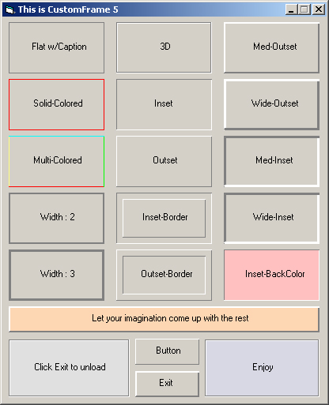



## Simple, yet usefull \- CustomFrame \- Choose From 3D, Inset, Outset, Flat, Multi\-Color etc\.\.\. Updated\!

### Description

Relatively simple, yet usefull control. I made this control becuase I constantly found myself putting together lines to make a raised/sunken frame effect. So, I decided to make a frame that can be customized to my needs, and besides, I need to learn how to make controls. This control's properties can be changed at design time as well as run time. Chande 3D/Flat, BackGround, Caption, Solid-Colored, Multi-Colored, Raised, Sunken and customizable border width(1-3). Handles Click/MouseDown-Up-Move events, and can be easily made into a button, (if needed to be), let me know of any bugs, suggestions or comments becuase I am VERY new to building controls.

----

Updated!, Can now be Opaque/Transparent. Changable at Design, authoring and run time... Thanks Anthony D for suggestion...
 
### More Info
 

             |
---                |---
**Submitted On**   |2006-09-10 02:19:02
**By**             |[Serge\_G](https://github.com/Planet-Source-Code/PSCIndex/blob/master/ByAuthor/serge-g.md)
**Level**          |Intermediate
**User Rating**    |5.0 (20 globes from 4 users)
**Compatibility**  |VB 4\.0 \(32\-bit\), VB 5\.0, VB 6\.0
**Category**       |[Custom Controls/ Forms/  Menus](https://github.com/Planet-Source-Code/PSCIndex/blob/master/ByCategory/custom-controls-forms-menus__1-4.md)
**World**          |[Visual Basic](https://github.com/Planet-Source-Code/PSCIndex/blob/master/ByWorld/visual-basic.md)
**Archive File**   |[Simple\_\_ye2019059102006\.zip](https://github.com/Planet-Source-Code/serge-g-simple-yet-usefull-customframe-choose-from-3d-inset-outset-flat-multi-color-etc-up__1-66491/archive/master.zip)

